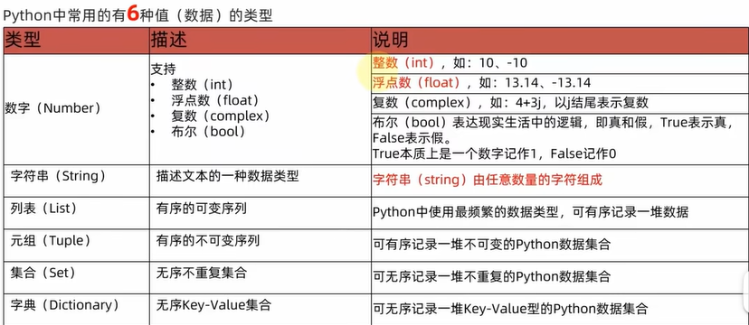
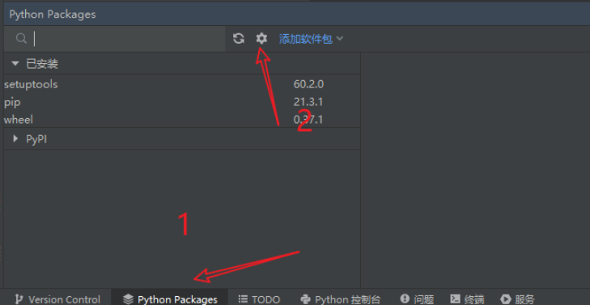
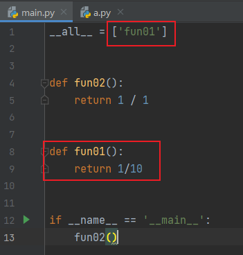
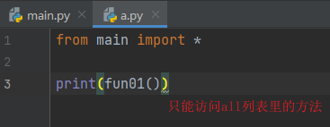
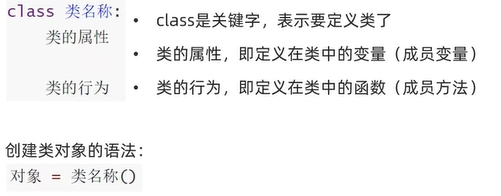

# 数据类型



```python
#float支持科学计数法
float(5.32E+2)
```


## 获取/判断数据类型

```Python
money = 10
type(2)
type("2")

if isinstance(money, type(2 / money)):
    print(1)
else:
    print(0)
```


# 字符串

## 拼接

```python
#输出11
print("1" + "1")
#输出abcabcabc
print("abc" * 3)
```

## 格式化

```Python
money = 10
name = "字符串"
money2 = 13.145

print(f"我是{name}，我有{money}元")#推荐
print("我是%s，我有%s元" % (name,money))#字符串替换
print("我有%5d元" % (money2))#5个整数宽度
print("我有%1.2f元" % (money2))#1个整数宽度，2个小数精度，会精度丢失不要用
print("我有%.2f元" % (money2))#2个小数精度，会精度丢失不要用

我是字符串，我有10元
我是字符串，我有10元
我有   13元
我有13.14元
我有13.14元
```


# if...elif...else

```python
var = "str"
if isinstance(var, int):
    print(0)
elif isinstance(var, str):
    print(1)
elif isinstance(var, list):
    print(2)
else:
    print(3)
```


# while

```python
money = 1
while money < 10:
    print(money)
    money += 1
```


# for

```python
list = ["1", "2", "3"]
for str in list:
    print(str)
    
    
name = "asdfkjewnvwqa"
list1 = []
for str in name:
    if str == "a":
        list1.append("A")
print(len(list1))
print(list1)
```

## continue

```python
name = "asdfkjewnvwqa"
list1 = []
for str in name:
    if str == "a":
        continue
    list1.append(str)
print(list1)
```

## break

```python
name = "asdfkjewnvwqa"
list1 = []
for str in name:
    if str == "j":
        break
    list1.append(str)
print(list1)
```

## 增强for

```python
list1 = [[1, 2], [3, 4], [5, 6]]
tuple_lis1t = [tuple(sublist) for sublist in list1]

a = [(2, 'aa', 'dsad'), (3, 'cc', 'dada'), (0, 'ss', 'okok')]
b = [list(i) for i in a]
```


# Stream/Lambda

Lambda语法

lambda 参数: 方法体

```python
#无参
f = lambda: "Hello, world!"
print(f())
#有参
x = lambda a : a + 10
print(x(5))

x = lambda a, b : a * b
print(x(5, 6))

#lambda 函数通常与内置函数如 map()、filter() 和 reduce() 一起使用，以便在集合上执行操作。例如：
numbers = [1, 2, 3, 4, 5]
squared = list(map(lambda x: x**2, numbers))
print(squared)  # 输出: [1, 4, 9, 16, 25]

numbers = [1, 2, 3, 4, 5, 6, 7, 8]
even_numbers = list(filter(lambda x: x % 2 == 0, numbers))
print(even_numbers)  # 输出：[2, 4, 6, 8]

# 使用 reduce() 和 lambda 函数计算乘积
from functools import reduce
numbers = [1, 2, 3, 4, 5]
product = reduce(lambda x, y: x * y, numbers)
print(product)  # 输出：120

#使用filter()得到整除2的数
a = [1, 23, 4, 52, 23]
print(list(filter(lambda x: x % 2 == 0, a)))
```

Stream需要导包。其他的方法名、操作和java的stream类似

```python
from superstream import Stream

foo = [[1, 2, 3], [4, 5, 6], [7, 8, 9]]
print(Stream(foo)
      .flat_map(lambda x: Stream(x))
      .filter(lambda x: x % 2 == 1)
      .map(lambda x: x + 1)
      .to_list())

foo2 = ["a", "b", "c", "d", "e"]
name = "1"
print(Stream(foo2).map(lambda t: t + f"{name}").to_list())
```


# range()

获得一个数字数列

```python
#0-4五个数字
for date in range(5):
    print(date)

#2-9区间
for date in range(2, 10):
    print(date)

#5-12区间，步长2
for date in range(5, 12, 2):
    print(date)

```


# 方法定义

```python
#单一返回值
def add(x, y):
    return x + y

print(add(1, 2))

#多返回值
def fun():
    a = 3
    b = 123.3
    c = "str"
    return a, b, c
a, b, c = fun()

#不定长参数方法。和java的Object...一致
def fun(*args):
    #args传入后类型是元组()
    return args
a = fun("a", "b")

#函数作为参数。类似java的函数式编程
def fun(ansy):
    return ansy(1, 2)

def ansy(x, y):
    return x + y

print(fun(ansy))

```


None==False（java不是）

```java
def add(x, y):
    if x is None or y is None:
        return None
    else:
        return x + y


if not add(None, 3):
    print(1)
else:
    print(2)

```


# 容器

## 列表

### 语法

Python支持List装载不同类型的数据且支持嵌套，相当于java的List<Object>

```python
var2 = []
var3 = list()
var = ["1", 1, 1.34, True, var2, var3, [1, 2, 3]]
```

### 常用方法

```python
#通过下标获取元素
nums = [10, 20, 30, 40, 50, 60, 70, 80, 90]
print(nums[2:3])#2号到3号区间，得30，等于nums[2]
print(nums[5])#60
print(nums[1:-2])#一号到倒数第二号区间，[20, 30, 40, 50, 60, 70]
print(nums[5:])#输出5号后面的所有元素，[60, 70, 80, 90]
print(nums[0:6:2])#0-6号，步长2，[10, 30, 50]
print(nums[::2])#从头到尾，步长2，[10, 30, 50, 70, 90]

#添加元素
nums.append('Baidu')

#更新元素
nums = [10, 20, 30, 40, 50, 60, 70, 80, 90]
nums[0] = 0
print(nums)

#删除元素
nums = [10, 20, 30, 40, 50, 60, 70, 80, 90]
del nums[0]
print(nums)

#列表长度
nums = [10, 20, 30, 40, 50, 60, 70, 80, 90]
print(len(nums))

#拼接列表
nums = [10, 20, 30, 40, 50, 60, 70, 80, 90] + [1]
print(nums)

nums = [3] * 3
print(nums)#[3, 3, 3]

#列表是否存在某个元素
nums = [10, 20, 30, 40, 50, 60, 70, 80, 90]
print(60 in nums)#True
print(5 in nums)#False

#比较
import operator

a = [1, 2]
b = [2, 3]
c = [2, 3]
print(operator.eq(b, c))#True
print(operator.eq(a, c))#False

#将元组转换为列表
list(seq)
#返回列表元素最大值
max(list)
#返回列表元素最小值
min(list)
#统计某个元素在列表中出现的次数
list.count(obj)
#在列表末尾一次性追加另一个序列中的多个值（用新列表扩展原来的列表）
list.extend(seq)
#从列表中找出某个值第一个匹配项的索引位置
list.index(obj)
#将对象插入列表
list.insert(index, obj)
#对原列表进行排序
list.sort( key=None, reverse=False)
#清空列表
list.clear()
```


## 元组

Python 的元组与列表类似，不同之处在于元组的元素不能修改。

元组使用小括号 **( )**，列表使用方括号 **[ ]**。

### 语法

和java 的数组Object[] objects = {};一样

```python
tup1 = ('Google', 'Runoob', 1997, 2000)
tup2 = ()
```

### 常用方法

出了不能修改，其他基本上和列表一致


## 集合

### 语法

集合（set）是一个无序的不重复元素序列。

集合中的元素不会重复，并且可以进行交集、并集、差集等常见的集合操作。

可以使用大括号 **{ }** 创建集合，元素之间用逗号 **,** 分隔， 或者也可以使用 **set()** 函数创建集合。

**注意：**创建一个空集合必须用 **set()** 而不是 **{ }**，因为 **{ }** 是用来创建一个空字典。

```python
set1 = {1, 2, 3, 4}
set2 = set([4, 5, 6, 7])
```

### 常用方法

其他的方法和列表基本上一致

```python
>>> basket = {'apple', 'orange', 'apple', 'pear', 'orange', 'banana'}
>>> print(basket)                      # 这里演示的是去重功能
{'orange', 'banana', 'pear', 'apple'}
>>> 'orange' in basket                 # 快速判断元素是否在集合内
True
>>> 'crabgrass' in basket
False

>>> # 下面展示两个集合间的运算.
...
>>> a = set('abracadabra')
>>> b = set('alacazam')
>>> a                                  
{'a', 'r', 'b', 'c', 'd'}
>>> a - b                              # 集合a中包含而集合b中不包含的元素
{'r', 'd', 'b'}
>>> a | b                              # 集合a或b中包含的所有元素
{'a', 'c', 'r', 'd', 'b', 'm', 'z', 'l'}
>>> a & b                              # 集合a和b中都包含了的元素
{'a', 'c'}
>>> a ^ b                              # 不同时包含于a和b的元素
{'r', 'd', 'b', 'm', 'z', 'l'}

s.remove( x )#将元素 x 从集合 s 中移除，如果元素不存在，则会发生错误。
s.discard( x )#移除集合中的元素，且如果元素不存在，不会发生错误
s.pop() #随机删除集合中的一个元素
```


## 字典

### 语法

java中的map

字典是另一种可变容器模型，且可存储任意类型对象。

字典的每个键值 **key=>value** 对用冒号 **:** 分割，每个对之间用逗号(**,**)分割，整个字典包括在花括号 **{}** 中 ,格式如下所示：

```python
d = {key1 : value1, key2 : value2, key3 : value3 }
c = {}
```

### 常用方法

```python
#访问key的value
tinydict = {'Name': 'Runoob', 'Age': 7, 'Class': 'First'}
print (tinydict['Name'])
print (tinydict['Age'])

#修改字典数据
tinydict = {'Name': 'Runoob', 'Age': 7, 'Class': 'First'}

tinydict['Age'] = 8               # 更新 Age
tinydict['School'] = "菜鸟教程"  # 添加信息

#删除
tinydict = {'Name': 'Runoob', 'Age': 7, 'Class': 'First'}
del tinydict['Name'] # 删除键 'Name'
tinydict.clear()     # 清空字典
del tinydict         # 删除字典
```

### 字典键的特性

java的map通常key是str，但可以是任意类型

字典值可以是任何的 python 对象，既可以是标准的对象，也可以是用户定义的，但键不行。

两个重要的点需要记住：

1）不允许同一个键出现两次。创建时如果同一个键被赋值两次，后一个值会被记住

2）键必须不可变，所以可以用数字，字符串或元组充当，而用列表就不行


# 两个二维列表取交集、差集

交集

```python
list1 = [[1, 2], [3, 4], [5, 6]]
list2 = [[3, 4], [5, 6], [7, 8]]

set1 = set(map(tuple, list1))
set2 = set(map(tuple, list2))

#方式一。
'''
1、元素要先转tuple元组，再转为set
2、交集核心方法是 intersection，此时格式是{(),()}
3、如果需要一样的格式[[],[]]，需要反向转型操作
'''
intersection = list(map(list, set1.intersection(set2)))
print(intersection)

#方式一。相当于嵌套for循环if判断
intersection = [item1 for item1 in list1 for item2 in list2 if item1 == item2]
print(intersection)

#[[5, 6], [3, 4]]
```

差集

```Python
a1 = [(1, 2), (3, 4), (5, 6)]
b1 = [(7, 8), (3, 4), (5, 6)]

#第一种：找出两个列表中所有不一致的对象。[(7, 8), (1, 2)]
print(list(set(a1) ^ set(b1)))
#第二种：基于a1，排除b1和自己相同的。[(1, 2)]
print(list(set(a1).difference(set(b1))))
```


# 文件操作

文件是一次性操作的，以下方法不能从头到尾执行，先读再度会为空

```python
# open
f = open(file="C://Users//Bill//Desktop//a.txt", mode="r", encoding="utf-8")
# read 从文件读取指定的字节数，如果未给定或为负则读取所有。
f.read()
# readlines 读取整行，包括 "\n" 字符。返回列表
lines = f.readlines()
# close 关闭文件流
f.close
# with open as 变量名。自动执行close （推荐）
with open(file="C://Users//Bill//Desktop//a.txt", mode="r", encoding="utf-8") as f:
    for line in f:
        print(line)
#for读取文件
f = open(file="C://Users//Bill//Desktop//a.txt", mode="r", encoding="utf-8")
for line in f:
    print(line)
f.close()

#写后读需要将指针再回到0
with open(file="C://Users//Bill//Desktop//a.txt", mode="r+", encoding="utf-8") as f:
    oldData = f.read()
    #定位指针在文件最前的文件头
    f.seek(0)
    f.write("我是文件头\n")
    f.write(oldData)
    #再次定位指针在文件最前从头读取
    f.seek(0)
    print(f.read())

```


# 异常

语法有个else和java不一样

另外，不同于java方法抛出异常，Python是没有throws exception显示语法的，但默认就带有该功能

语法

```Python
try:
    a = 1/1
except Exception as e:
    print(e)
else:
    print("done")
finally:
    print("end")
```

异常传递

```Python
def fun01():
    try:
        fun02()
    except Exception as e:
        print(e)


def fun02():
    a = 1 / 0


fun01()#division by zero
```


# 导包

## from/import

```python
#只导入某个包的方法
from 模块名 import 功能名
功能名()

from time import sleep
print(sleep(1))

#导入整个模块，可以访问方法，属性，类等
import 模块名
模块.方法名()

import time
print(time.sleep(1))

#导入全部功能
from time import * 
方法名()

#可以取别名
import time as tm
tm.sleep(1)
```

## \_\_init\_\_.py

特殊文件，用于标识该文件夹是一个包。可以为空，也可以设置权限等

```python
#__init__文件内容。表示控制init文件所在的包，哪些文件或者方法可以访问
__all__ = ["test01"]
```

1、相对复杂的，命名空间分层次的模块，使用__init__.py文件是必要的。
2、包里面的模块使用前， 需要进行一些初始化操作的模块，使用__init__.py文件是必要的。
3、__\_\_init\_\___.py文件里面的程序， 只在模块被识别/找到模块名的时候被执行一次。 即使你多次导入这些模块，也只会执行一次。 除非你同时使用importlib和import.reload()的时候，才会被显式的被执行。

## 国内pip

pycharm直接配置：



https://pypi.tuna.tsinghua.edu.cn/simple


# 内置类方法（魔术方法）

## \_\_main\_\_

相当于java的psvm入口

```python
'''
在当前类有此句代码表示这是执行的入口，当前类启动后内置的__name__属性会设置__main__，进而执行if里面的逻辑
作用：本类想测试test()，但不想被其他类引用的时候默认执行test
'''
def test():
    pass

#如果想测试在类最后调用方法，在被其他类import的时候也会执行，这是不想看见的，可以将其方法放到main函数中
test()

if __name__ == '__main__':
    test()
```

## \_\_all\_\_

相当于java的方法权限控制

main方法配置__all__列表。不写则全可访问



当使用from main import *导包时，只能访问__all__列表里的方法。如果不是import *而是import 功能名，则不会存在限制





## \_\_init\_\_

构造方法，和java的一样

## \_\_str\_\_

控制类转换为字符串的行为和内容

可以重写，和java的getString方法一致

## \_\_lt\_\_和\_\_le\_\_

控制类某个属性比较的行为和方式

## \_\_eq\_\_

控制类的比较行为，判断内容（哈希）是否相等

## \_\_closure\_\_

判断当前对象是否闭包。展示闭包存储外部函数的变量，

```python
#用上哪个闭包存储变量才输出哪个cell地址
def outer(logo, s):
    def inner(msg):
        nonlocal logo
        logo = "body"
        print(f"<{logo}>{msg}<{logo}> {s}")

    return inner

outer = outer("html", 2)
print(outer.__closure__)

#(<cell at 0x000002141EE88AF8: str object at 0x000002141EEC0C38>, <cell at 0x000002141EE88CA8: int object at 0x0000000061968090>)
```


# 类的定义



python没有java的get/set方法，直接通过类.属性 = 值 赋值

# 成员变量

私有变量需要在变量名前双下划线__表示私有（java中的private）

和java 的成员属性一致，但是可以忽略不写，通过\_\_init\_\_参数定义

```python
class DoEx:
    def __init__(self, var):
        self.__var = var
```

私有变量问题：

```python
class Phone:
    IMEI = None  # 序列号
    producer = None  # 厂商_
    __current_voltage = None  # 当前电压

    def call_by_5g(self):
        print("5g通话已开启")


    def __keep_single_core(self):
        print("让CPU以单核模式运行以节省电量")

phone = Phone()
phone.__current_voltage = 33 #私有变量赋值 不报错，但无效
print(phone.__current_voltage) #获取私有变量 报错

```

# 成员方法的定义

私有方法需要在方法名前双下划线__表示私有（java中的private）。私有方法无法直接被类对象使用

如果在类中的方法需要多个默认参数：self

和java的this一样

```python
def DownLoadFileTree(self, localDir):
    pass
```

在调用同一个类的成员方法需要self.方法()

```python
class DoEx:
    def __init__(self, var):
        self.var = var

    def __fun01(self):
        print(self.var)

    def fun02(self):
        self.__fun01()
        
        
DoEx("do main").fun02()
```


# 继承

和java不同，java只能单继承，python可以实现**多继承**

Farther文件

```python
class Farther:
    def __init__(self, farther_msg):
        self.__farther_msg = farther_msg

    def farther_fun(self):
        print(self.__farther_msg)

```

Son文件，继承于Farther

```python
from doEc.Farther import Farther

#多继承 class Son(Farther1,Farther2,...):
class Son(Farther):
    def __init__(self, farther_msg, son_msg):
        super().__init__(farther_msg)
        self.__son_msg = son_msg

    def son_fun(self):
        self.farther_fun()


son = Son("farther_msg", "son_msg")
son.son_fun()

#输出farther_msg
```


# 重写

同名方法+同参数列表时重写方法体，会覆盖原有方法逻辑。和java一致，不过没有@Override标明

注意：只可以在子类内部调用父类的同名成员,子类的实体类对象调用默认是调用子类复写的

```python
class Farther:
    def __init__(self, farther_msg):
        self.__farther_msg = farther_msg

    def farther_fun(self):
        print(self.__farther_msg)

    #get/set提供对外访问私有属性
    def get_private_param(self):
        return self.__farther_msg

```

```python
from doEc.Farther import Farther


class Son(Farther):
    farther_msg = "覆盖父类属性"
    
    def __init__(self, farther_msg, son_msg):
        super().__init__(farther_msg)
        self.__son_msg = son_msg

    def son_fun(self):
        self.farther_fun()

    #重写父类farther_fun方法
    def farther_fun(self):
        print("父类私有属性：" + self.get_private_param())
		print(self.farther_msg)
     
    #子类调用父类的方法
    def son_fun1(self):
        super().farther_fun()

son = Son("farther_msg", "son_msg")
son.son_fun()
son.son_fun1()

'''
父类私有属性：farther_msg
覆盖父类属性
farther_msg
'''
```

# 注解

## 变量的类型注解

因为是非强类型语言，pycharm的提示需要标明，方便开发维护，相当于注释作用

嵌套类型需要一层层标明

```python
#方式一
var_1: dict[str,int] = {"it":3}
var_2: list[int] = [1,2,3]
stu: Student = Student() #对象类型
    
#方式二
var_1 = random.randint(1,10) #type: int
var_2 = func()               #type: Student
```

## 方法类型注解

形参注解

提示作用，传入非同类型如果逻辑没问题是不会报错的，区别于java强类型传参

```python
    def add(self, x: int, y: int):
        return x + y
```

返回值注解

提示作用，提示返回值类型

```python
    def add(self, x: int, y: int) -> str:
        return str(x + y)
```

## Union联合类型注解

python允许数据容器中存放不同类型的数据，所以会有联合类型注解出现

```python
from typing import Union, List, Dict
my_list: List[Union[str, int]] = [1, "2", 3, "4"]
my_dict: Dict[str, Union[str, int]] = {"key1": "value", "key2": 2}
    
def func(x: List[Union[str, int]]) -> Dict[str, Union[str, int]]:
    print(x)
    return dict()
```


# 多态

在python中，多态作用于继承关系。抽象类和接口对于python来说是同一种概念

即：父类可以接收一切其子类对象


设计含义：

父类用来确定方法

具体实现由子类重写决定


抽象类：含有抽象方法的类称之为抽象类

抽象方法：方法体是空实现的（pass）称之为抽象方法

```python
#抽象类
class Animal:
    def speak(self):
        pass


#实现类（子类）
class Dog(Animal):
    def speak(self):
        print("www")

        
#实现类（子类）
class Cat(Animal):
    def speak(self):
        print("mmm")


#多态接收参数，调用实现方法
def do_speak(animal: Animal):
    animal.speak()

dog = Dog()
cat = Cat()
do_speak(dog)
do_speak(cat)
```


# 泛型

概念和java一致，但用法和声明区别较大

```python
from typing import Generic, TypeVar

#定义泛型类型范围
T = TypeVar('T')  # Can be anything
A = TypeVar('A', str, bytes)  # Must be str or bytes

#继承声明泛型的Generic类
class Phone(Generic[A, T]):
    def func(self, obj: T) -> A:
        return str(obj)


phone = Phone()
print(type(phone.func(1)))
```


# 闭包

读取函数内部的局部变量，避免对外暴露和拒绝被引用修改隐藏的变量。不同于java，java无法读取函数内部的变量，但可以将函数封装为对象，将函数内部的变量设置在类的属性上并给与private权限和提供get/set方法来访问

优点：

- 无需定义全局变量即可实现通过函数，持续的访问、修改某个值
- 闭包使用的变量的所用于在函数内，难以被错误的调用修改

缺点

- 由于内部函数持续引用外部函数的值，所以会导致这一部分内存空间不被释放，一直占用内存（可以忽略）

## 基本语法

```python
#在python中可以在方法里定义方法和局部变量
#将logo全局变量保护起来避免外部引用修改

#logo = "html"
def outer(logo):
    def inner(msg):
        print(f"<{logo}>{msg}<{logo}>")
    return inner #一定要返回内部方法本体对外调用

outer = outer("html")#设置全局保护变量
outer("html书签页")#其实就是调用了inner方法传参msg
#输出<html>html书签页<html>
```

## nonlocal关键字

若想修改最外层方法的局部变量，可以通过该关键字声明后修改

logo变量一旦被初始化，是一直存在于内存的，除非被内部函数修改

```python
def outer(logo):
    def inner(msg):
        nonlocal logo
        logo = "body"
        print(f"<{logo}>{msg}<{logo}>")
    return inner

outer = outer("html")
outer("html书签页")
```


# 装饰器

由闭包演变而来。对于java来说其实就是动态代理，对于springboot来说，就是AOP切面增强

按照闭包的方式来增强，显得冗余不简洁：

```python
#闭包方式
def outer(func):
    def inner():
        print("doing before")
        func()
        print("doing after")

    return inner


def sleep():
    print("doing process")

#outer(sleep)其实返回的就是inner，还需要再调用一次，代码显得不够简洁
outer = outer(sleep)
outer()#等同于outer = outer(sleep)()
```

装饰器模式

```python
#入口参数一定要是函数类型
def outer(func):
    def inner():
        print("doing before")
        func()
        print("doing after")
    return inner

#打上与闭包方法名同名的注解
@outer
def sleep():
    print("doing process")

#直接调用最外层方法即可
sleep()
```


# 反射

| 方法                        | 用法                                                         |
| --------------------------- | ------------------------------------------------------------ |
| hasattr(obj,name_str)       | 判断输入的name_str字符串在对象obj中是否存在(属性或方法)，存在返回True，否则返回False。 |
| getattr(obj,name_str)       | 将按照输入的name_str字符串在对象obj中查找，如找到同名属性，则返回该属性；如找到同名方法，则返回方法的引用；如果未能找到同名的属性或者方法，则抛出异常：AttributeError。 |
| setattr(obj,name_str,value) | name_str为属性名或者方法名，value为属性值或者方法的引用。    |
| delattr(obj,name_str)       | 将你输入的字符串name_str在对象obj中查找，如找到同名属性或者方法就进行删除。 |

```python
class Farther:
    def __init__(self, farther_msg, name):
        self.__farther_msg = farther_msg
        self.name = name

    def farther_fun(self):
        print(self.__farther_msg)

    def get_private_param(self):
        return self.__farther_msg

farther = Farther("msg","n")
attr1 = getattr(farther, "_Farther__farther_msg")#反射获取私有属性
attr2 = getattr(farther, "name")#反射获取公共属性

setattr(farther,"name","is name")#反射设置属性
```


# 锁

保持操作的原子性

```python
import threading

# 全局变量
counter = 0
lock = threading.Lock()

def increment():
    global counter
    for _ in range(1000000):
        # 获取锁
        lock.acquire()
        try:
            counter += 1
        finally:
            # 释放锁
            lock.release()

def un_increment():
    global counter
    for _ in range(1000000):
            counter += 1

# 创建两个线程并启动它们
# thread1 = threading.Thread(target=increment)
# thread2 = threading.Thread(target=increment)
thread1 = threading.Thread(target=un_increment)
thread2 = threading.Thread(target=un_increment)

thread1.start()
thread2.start()

# 等待两个线程完成
thread1.join()
thread2.join()

print("最终的计数器值:", counter)
```


# 多线程

和java的本质一致，使用方法有区别

```python
thread_obj = threading.Thread()#创建线程
```

多线程很复杂，不作为基础内容


